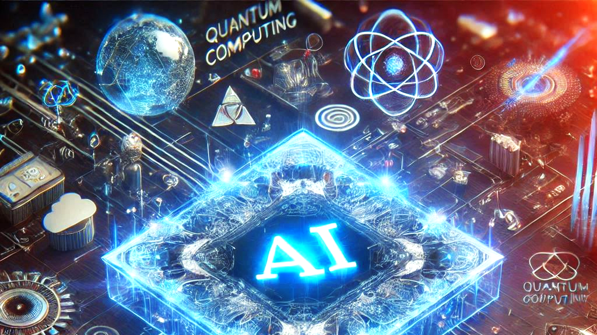

# Bienvenue sur ma page de profil Github !

## Général

### 🚀 Mes objectifs professionnels

Ma volonté serait de pouvoir continuer dans le domaine de la recherche, que ce soit dans un centre publique ou bien un laboratoire de R&D en entreprise.

Ayant une spécification pour mon diplôme d’ingénieur généraliste en informatique dans le domaine de l’IA grâce au double diplôme, j’aimerais découvrir davantage ce domaine en plein essort dans un premier temps, au vu du nombre d’applications, de défis et de conséquences que cela apporte actuellement et va apporter à l’avenir. Je ne pense pas me restreindre à être spécialisé dans un champ spécifique du domaine, souhaitant être le plus polyvalent possible, même si actuellement les options suivies en supplément avec le Master sont orientées vers les domaines de la Computer Vision et des Larges Languages Models (LLMs), mettant un peu de côté le domaine traitant des techniques d’apprentissage (machines, par renforcement…) visant des applications plus en lien avec des robots.

Mais dans l’optique d’un apprentissage constant et d’un enrichissement de mes connaissances, en tenant compte des changements les plus probables et conséquents qui vont apparaître dans le domaine de l’informatique, je souhaiterais acquérir des compétences en lien avec le domaine de l’informatique quantique.

## 📎Mes compétences
En lien avec la fiche RNCP de la [formation d'ingénieur informatique Polytech Lyon](https://www.francecompetences.fr/recherche/rncp/36354/)

 - ### <ins> Mon stage de 4A </ins>
  Lors de mon stage de 4A, j'ai su mettre en oeuvre les compétences suivantes:
    - M'investir, faire preuve d'initiative et d’agilité tout en reconnaissant les
      situations générant stress et tensions et en agissant avec empathie
    - Rendre compte de mon travail, capitaliser savoir et expérience
    - Collecter et traiter des données : rechercher, évaluer, classer et exploiter des
      informations bibliographiques, scientifiques, techniques ou relatives à la
      production
    - Rendre compte, mettre en forme et échanger idées ou informations sous
      différentes formes, orales ou écrites, en présentiel et à distance
    - Communiquer en langue étrangère, m'adapter à la communication verbale et
      non-verbale des partenaires dans des contextes potentiellement internationaux
      et interculturels [Document de soutenance](https://fr.overleaf.com/read/dhzshcrrqjvv#4367e8) [Rapport interne](https://fr.overleaf.com/read/tccvqrrxbkgj#fb8671) [Rapport de stage](https://fr.overleaf.com/read/hjppxsqmhmxx#c49326)
    - De prendre du recul et gérer mon projet professionnel au fil du temps

### Job d'été :
  - S'intégrer dans une organisation en prenant en compte les outils et enjeux
    économiques de l'entreprise : respect de la qualité, compétitivité et
    productivité, exigences commerciales
  - S’investir, faire preuve d'initiative et d’agilité tout en reconnaissant les
    situations générant stress et tensions et en agissant avec empathie

En lien avec mon double-diplôme en M2IA :
  - pour le traitement d'image : les repositories des TPs
  - pour les LLM : [la proposition de projet soumise pour l'UE](https://fr.overleaf.com/read/nqwkrvhpttbq#0cb8d1)
    
Pour la compétence de rédaction de rapport :

Autres : ma participation aux repositories suivants

## 🛰️ Contact
 : **[Compte LinkedIn](https://www.linkedin.com/in/thomas-blumet/)**

## Notes & Annexes

