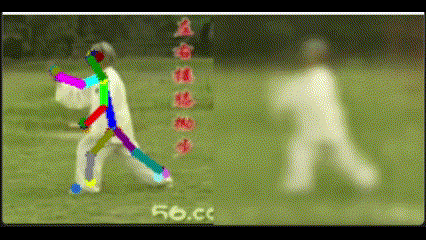

# Général

## 🚀 Mes objectifs professionnels

Ma volonté serait de pouvoir continuer dans le domaine de la recherche, que ce soit dans un centre publique ou bien un laboratoire de R&D en entreprise.

Ayant une spécification pour mon diplôme d’ingénieur généraliste en informatique dans le domaine de l’IA grâce au double diplôme, j’aimerais découvrir davantage ce domaine en plein essort dans un premier temps, au vu du nombre d’applications, de défis et de conséquences que cela apporte actuellement et va apporter à l’avenir. Je ne pense pas me restreindre à être spécialisé dans un champ spécifique du domaine, souhaitant être le plus polyvalent possible. Les options suivies en supplément avec le Master étaient orientées vers les domaines de la Computer Vision et des Larges Languages Models (LLMs), tandis que les cours d'ingénieur sur l'IA relevaient principalement du Machine Learning pour le Big Data ou du Reinforcement learning pour les agents autonomes.

Mais dans l’optique d’un apprentissage constant et d’un enrichissement de mes connaissances, en tenant compte des changements les plus probables et conséquents qui vont apparaître dans le domaine de l’informatique, je souhaiterais acquérir quelques compétences en lien avec le domaine de l’informatique quantique.

# Portfolio 📁
## 📎Mes compétences
En lien avec la fiche RNCP de la [formation d'ingénieur informatique Polytech Lyon](https://www.francecompetences.fr/recherche/rncp/36354/)

## <ins> Mon stage de 5A : </ins>
   

   À ce titre :
   - [Rapport de stage](https://fr.overleaf.com/read/qscfmrjxdchb#666896)

## <ins> Mon stage de 4A : </ins>
   
   
   Réalisé au centre DFKI de Kaiserlautern (Allemagne).
   
   À ce titre :
   - [Diaporama de soutenance](https://fr.overleaf.com/read/dhzshcrrqjvv#4367e8)
   
   - [Rapport interne au centre](https://fr.overleaf.com/read/tccvqrrxbkgj#fb8671)
   
   - [Rapport de stage](https://fr.overleaf.com/read/hjppxsqmhmxx#c49326)

    
## <ins> En lien avec mon double-diplôme en M2IA : </ins>

### UE Traitement d'image & Deep Learning :
  
   **[TP : Posture-guided image synthesis of a person](https://github.com/ThomasBlumet/M2IA_TPAM_Skeleton)**
   - 
   
   **[TP : Style Transfer](https://github.com/ThomasBlumet/M2IA_TPAM_StyleTransfer)**

   **[TP : Implicit Neural Reconstruction](https://github.com/ThomasBlumet/M2IA_TPJD_INR)**
  
   **[TP : Deep Neural Prior Network](https://github.com/ThomasBlumet/M2IA_TPJD_DNPrior)**
  
   **[TP : PointNet ](https://github.com/ThomasBlumet/M2IA_TPJD_PointNet)**
  
   **[TP : Diffusion for images ](https://github.com/ThomasBlumet/M2IA_TPNB_Diffusion)**
  
     
### UE LLM (Large Language Model) :
   - [la proposition de projet soumise rédigée en LaTex via Overleaf](https://fr.overleaf.com/read/nqwkrvhpttbq#0cb8d1)
   - Vidéo de démo :
     - 

## <ins> D'autres repositories : </ins>

### [Projet Transfert Learning : réseau de neurone convolutionnel (CNN) YOLO pour le jeu du Pierre-Feuille-Ciseau](https://github.com/florianBurdairon/PolytechTP5AHandGestureGames/tree/main)
  - Vidéo de démo :
  -  

### Projet IoT : réalisation d'une cafetière connectée
   - [Partie rapport](https://github.com/florianBurdairon/polytech-iot-coffeemachine-report)
   - [Partie Hardware - ESP32](https://github.com/florianBurdairon/polytech-iot-coffeemachine-esp)
   - [Partie Software - Application Android](https://github.com/florianBurdairon/polytech-iot-coffeemachine-android)

### Projet Big Data : API de serving pour un modèle prédictif en Machine Learning, avec application web utilisateur, système de reporting et de monitoring en temps réel
   - Voir le [dépôt Github du projet de groupe](https://github.com/Polytech-bigdata/ML_project)

### (À venir : futurs projets)

## 🛰️ Contact
 ****
